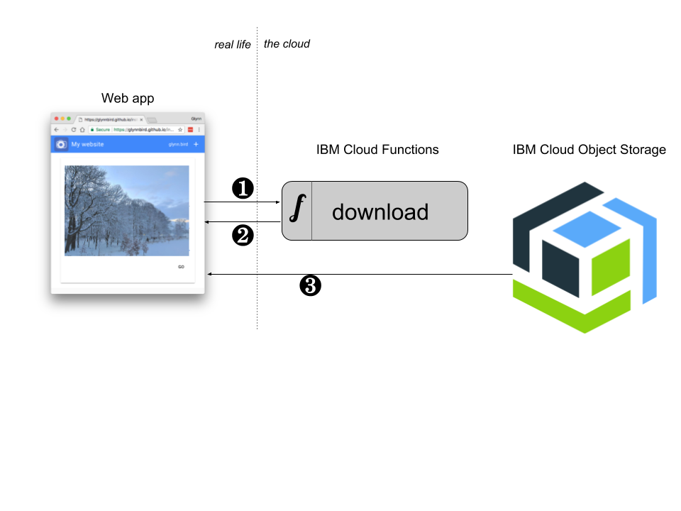

# cos-downloader

If you want to download files from IBM's Cloud Object Storage to a web browser, but you don't want to hard code your service credentials in a client side app (for good reason) then this is one solution:



1. The web app makes an API call to an IBM Cloud Functions action to indicate that it wishes to download a file
2. The serverless action calculates a time-limited URL that allows the download of a single object. The URL is sent out as an HTTP 302 Redirect response
3. The the browser's request is redirected to a URL and fetches th file direct from Object Storage.

## Sign up for IBM Cloud Object Storage

We're going to need an IBM Cloud Object storage service or an Amazon S3 account. IBM’s service supports a subset of the S3 API for easy migration. With a couple simple steps, we can use the same code on IBM Cloud Object Storage or Amazon S3.

Sign up for an IBM Cloud account. Once registered, you can add an [IBM Cloud Object Storage service](https://console.bluemix.net/catalog/services/cloud-object-storage) - the Lite plan gives you a generous free allocation to play with. 

In the IBM Cloud Object Storage UI, you can

- create a bucket - this is the "folder" where your uploaded files will be kept
- create a set of credentials that we are going to use in our serverless script. When creating these credentials, you’ll need to pass in a flag to enable S3-style authentication: `{"HMAC":true}` to enable Amazon compatibility. 

Make a note of the bucket name, the API endpoint and your keys for the next step.

## Enable CORS

Enabling CORS on an object storage bucket enables it to be accessed directly from a web page without hitting any security restrictions.

Install the [aws](https://aws.amazon.com/cli/) command-line tool and create a `~/.aws/credentials` file containing your object storage service's key and secret:

```
[default]
aws_access_key_id=MY_PUBLIC_KEY
aws_secret_access_key=MY_PRIVATE_KEY
```

You should then be able to see the contents of your bucket:

```sh
aws --endpoint-url=https://s3-api.us-geo.objectstorage.softlayer.net/ s3 ls s3://mybucket
```

Create a file called `cors.json` that contains the same data as contained in the cors.json in this repository.

Then we can enable CORS with:

```sh
aws --endpoint-url=https://s3-api.us-geo.objectstorage.softlayer.net/ \
  s3api \
  put-bucket-cors \
  --bucket mybucket \
  --cors-configuration file://cors.json
```

## Install the bx wsk tool

To deploy code to IBM Cloud Functions we need the `bx wsk` tool installed and configured on your machine. Follow the [instuctions here](https://console.bluemix.net/openwhisk/learn/cli)

## Deploy to Cloud Functions

Set some environment variables with your object storage credentials and endpoint:

```sh
export access_key='xxx'
export secret_key='yyy'
export bucket='mybucket'
export endpoint='https://s3-api.us-geo.objectstorage.softlayer.net'
```

and run the deployment script:

```sh
./deploy.sh
```

The `deploy.sh` script should output the URL of your serverless action. It will be something like:

    https://openwhisk.ng.bluemix.net/api/v1/web/ORG_SPACE/default/download

You can call the API from curl to test it, passing the id of a file which exists in your Object Storage bucket:

```sh
curl -v 'https://openwhisk.ng.bluemix.net/api/v1/web/ORG_SPACE/default/download?id=test.txt'
< HTTP/1.1 302 Found
< Location: https://s3-api.us-geo.objectstorage.softlayer.net/mybucket/test.txt?AWSAccessKeyId=xxx&Signature=zzz&Expires=1520245061
< 
```

If you visit the returned URL in a browser it should download your file. Note this link is time-limited so will only work for sixty seconds from creation.

## Using in a web page

If your files are images, then you can construct `` tags that contain links to your serverless action:

```html

```

## Links

If you need to upload files from browser to Object Storage then [this repostory](https://github.com/ibm-watson-data-lab/cos-uploader) can help.